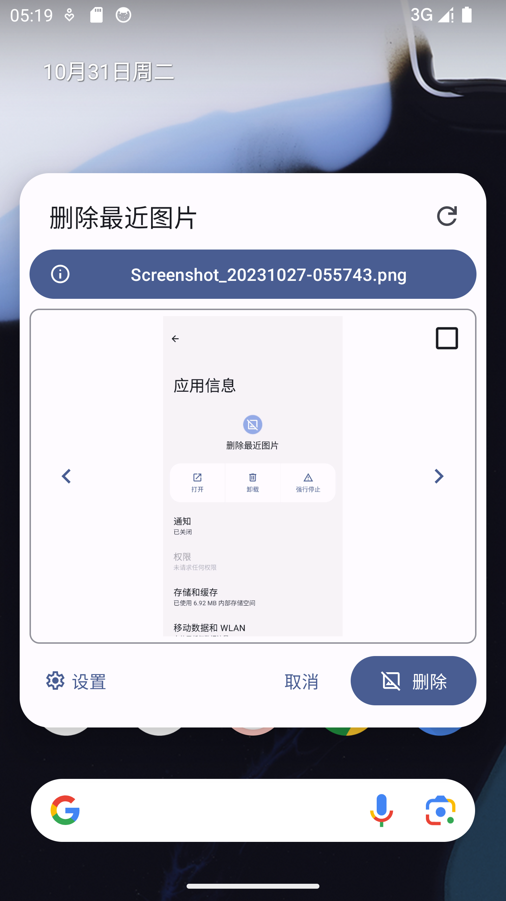
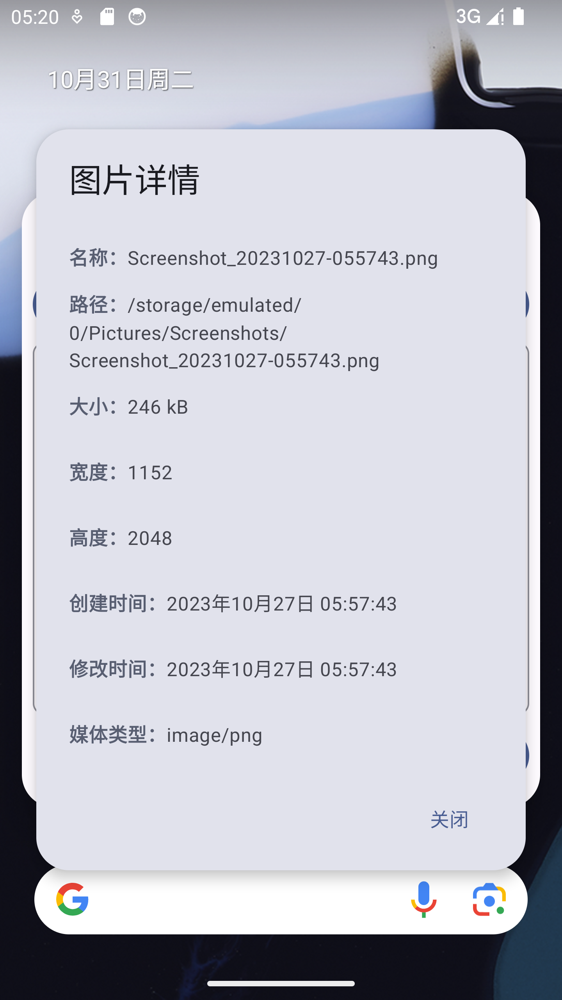
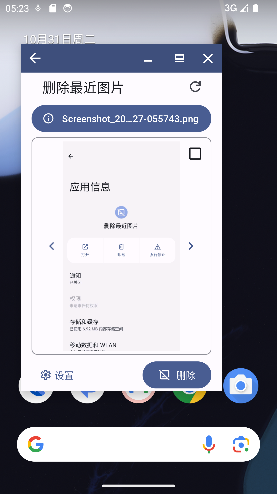
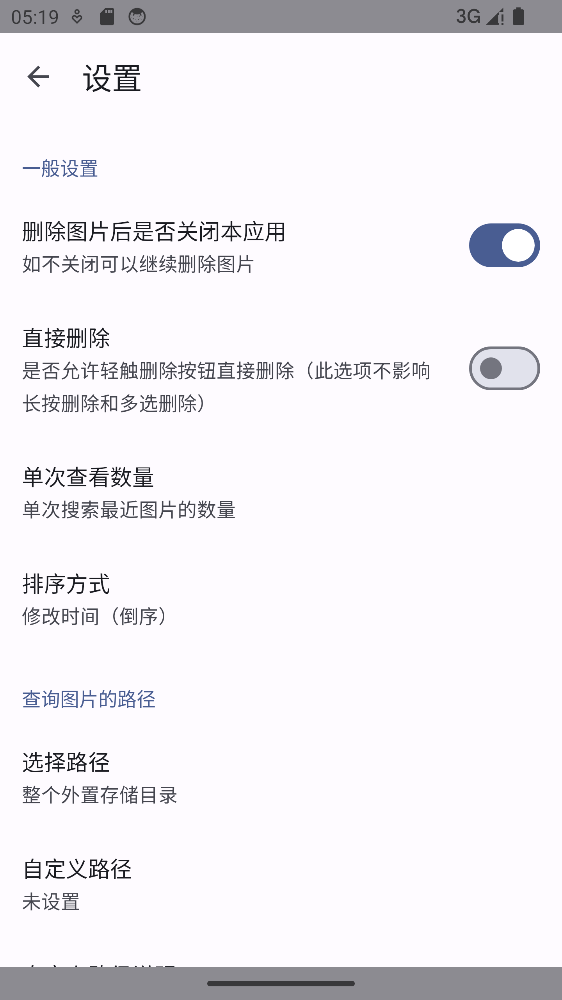

# Eliminar Imágenes Recientes

Elimina las imágenes más recientes de tu teléfono, incluyendo pero no limitado a capturas de pantalla, fotos, etc., siempre que la imagen sea visible tras el escaneo de medios del sistema. Ideal para solucionar problemas de imágenes guardadas accidentalmente, capturas de pantalla o fotos no deseadas. Se recomienda su uso junto con aplicaciones de botón flotante, barras laterales o mediante el acceso rápido en los ajustes rápidos de la barra de estado.

### Sistemas Soportados

Android 6.0 (SdkVersion 23) y versiones superiores.

### Funciones

+ Soporte para cambiar entre imágenes
+ Soporte para vista de imagen ampliada
+ Soporte para ver información de la imagen
+ Soporte para abrir con otras aplicaciones y compartir
+ Soporte para reconocimiento de códigos QR
+ Eliminación múltiple
+ Permite personalizar la ruta de búsqueda
+ Soporte para reproducción de GIFs y visualización de imágenes extra grandes
+ Soporte para acceso desde el panel de ajustes rápidos
+ Soporte para modo oscuro
+ Utiliza Material You, con soporte para colores dinámicos de Monet
+ Soporte para ocultarse en la lista de aplicaciones recientes
+ 【Experimental】 Soporte para diseños específicos en modo multitarea (ventana flotante, pantalla dividida, etc.)
+ 【Experimental】 Soporte para función temporal de deshacer eliminación

### Vistas Previas

### Descarga

[https://github.com/1045290202/DeleteRecentPictures/releases/latest](https://github.com/1045290202/DeleteRecentPictures/releases/latest)

### Librerías de Código Abierto

+ [ZoomImage](https://github.com/panpf/zoomimage)
+ [ZXing](https://github.com/zxing/zxing)
+ [RikkaX](https://github.com/RikkaApps/RikkaX)
+ [Apache Commons IO](https://github.com/apache/commons-io)
+ [OpenImage](https://github.com/FlyJingFish/OpenImage)

-------

Sigue al desarrollador en Coolapk: *[@来一斤BUG](https://www.coolapk.com/u/458995)*
