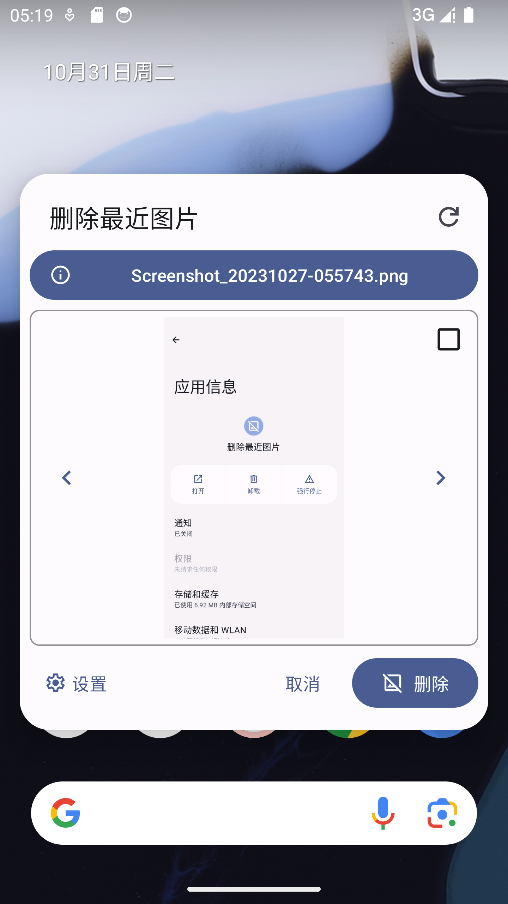

# 删除最近图片
删除手机里最近的图片，包括但不限于截图、照片等，只要图片被系统媒体扫描后就能显示。解决不小心保存图片、截屏、拍照等问题。建议配合悬浮球、侧边栏等类型的APP使用，或者利用状态栏中的快速磁贴打开。

### 支持系统
Android 6.0（SdkVersion 23）及以上

### 功能
+ 支持图片切换
+ 支持大图模式查看
+ 支持查看图片信息
+ 支持用其他应用打开以及分享
+ 支持二维码识别
+ 多选删除
+ 允许自定义查找路径
+ 支持GIF播放和超大图查看
+ 支持从快速设置磁贴
+ 支持暗色模式
+ 使用Material You，支持Monet取色
+ 支持在最近运行任务中隐藏
+ 【实验性】支持多窗口模式（小窗和分屏等）下特有的布局
+ 【实验性】支持临时的撤销删除功能

### 预览图

 
### 下载
[https://github.com/1045290202/DeleteRecentPictures/releases/latest](https://github.com/1045290202/DeleteRecentPictures/releases/latest)

### 开源库
+ [ZoomImage](https://github.com/panpf/zoomimage)
+ [ZXing](https://github.com/zxing/zxing)
+ [RikkaX](https://github.com/RikkaApps/RikkaX)
+ [Apache Commons IO](https://github.com/apache/commons-io)

-------

在酷安上关注开发者： *[@来一斤BUG](https://www.coolapk.com/u/458995)*
